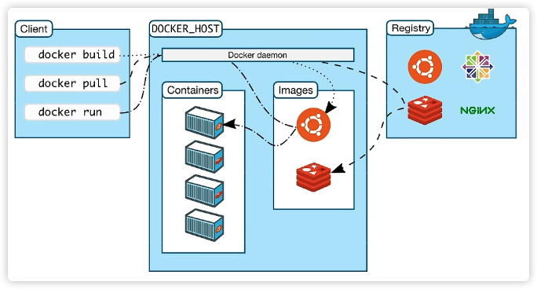
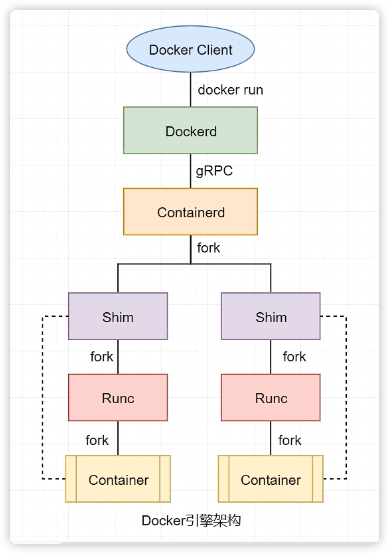
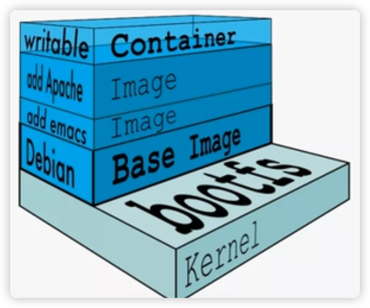
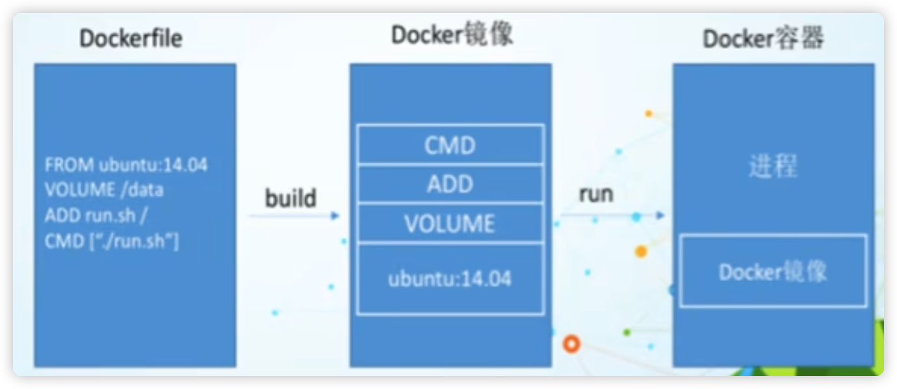
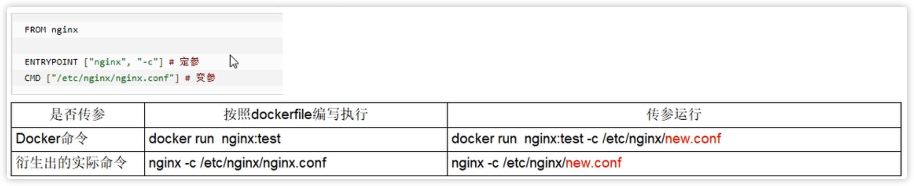
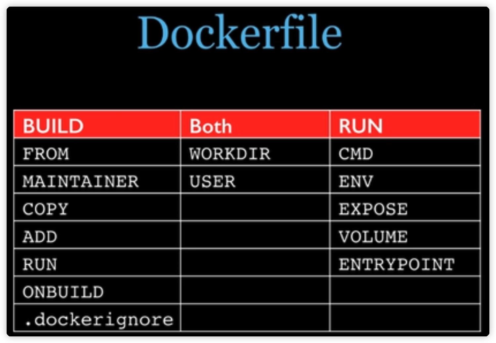

# Docker for beginner

IMPORTANT : ==If you just want to get the necessary Docker knowledge you need to complete this project, please skip the first two chapters.==

## 1 Docker 概述

Docker overview

### 1.1 课程引入

Course introduction

* 1.1.1 开发与运维
    Development and Operations
    * 开发与测试和运维间的矛盾,  主要是由于环境的不同引发的. 如果能将开发人员使用的环境交给测试与运维使用, 将会大大方便项目的推进
        Conflicts between development, testing, and operation and maintenance are mainly caused by differences in environments. If the environment used by developers can be handed over to testing and operation and maintenance, it will greatly facilitate the advancement of the project.
* 1.1.2 DevOps
    * 一种思想, 一种管理模式和执行规范, 用于促进开发, 测试与运维部门之间的沟通, 协作与整合
        An idea, a management model and execution specification to promote communication, collaboration and integration between development, testing and operation and maintenance departments
* 1.1.3 运维与架构师
    Operations and Architect
    * 运维希望能一键部署
        Operation and maintenance hopes to be able to deploy with one click
* 1.1.4 学习中集群搭建的问题
    Problems with cluster construction during learning
    * 学习过程中, 由于机器配置较低从而导致启动的虚拟机较少, 影响学习效率
        During the learning process, due to the low machine configuration, fewer virtual machines are started, which affects learning efficiency.

### 1.2 Docker的简介

Introduction to Docker

* 开源的应用容器引擎, 可以让开发者将应用及应用运行的环境打包到一个轻量级, 可移植的镜像中, 然后发布到任何流行的Linux等系统的机器上.
    The open source application container engine allows developers to package applications and application running environments into a lightweight, portable image, and then publish them to any popular Linux and other system machines.
* 使用Go语言开发
    Developed using Go language
* [Docker](http://docker.com)

### 1.3 Docker 的用途

The use of Docker

* 1.3.1 提供统一的运行环境
    Provide a unified operating environment
    * 确保在任何宿主机HOST可以得到相同的结果
        Ensure that the same results can be obtained on any host HOST
* 1.3.2 便捷的应用迁移
    Convenient application migration
    * 确保了统一的运行环境, 使得应用的迁移更便捷. 用户可以方便的将一个平台上运行的应用, 迁移到另一个平台.
        It ensures a unified operating environment and makes application migration more convenient. Users can easily migrate applications running on one platform to another platform.
* 1.3.3 超快的启动时间
    Super fast boot time
    * Dock容器应用直接云星宇宿主机系统, 无需启动操作系统, 因此可以做到秒级, 甚至毫秒级的启动. 传统的虚拟机技术应用一般需要数分钟: 启动虚拟机, 加载虚拟机操作系统, 手工启动应用...
        The Dock container application is directly connected to the Xingyu host system without starting the operating system, so it can be started in seconds or even milliseconds. Traditional virtual machine technology applications generally take several minutes: starting the virtual machine, loading the virtual machine operating system, and manually Launch the app...
* 1.3.4 更轻松的维护和扩展
    Easier maintenance and expansion
    * 有[官方的镜像](hub.docker.com), 可以直接在生产环境中使用, 也可以进一步定制, 大大降低了应用服务镜像的成本.
        There is an [official image](hub.docker.com), which can be used directly in the production environment or further customized, which greatly reduces the cost of application service images.
    * Docker使用分层存储以及镜像技术, 使得应用重复部分的复用率更为容易, 也使得英勇的维护更新更加简单.
        Docker uses layered storage and mirroring technology to make it easier to reuse duplicate parts of the application, and also makes heroic maintenance and updates simpler.

### 1.4 容器与虚拟机的区别

The difference between containers and virtual machines

* Docker容器的本质就是通过容器虚拟技术虚拟出的一台主机, 就像虚拟机一样, 可以将应用及其运行环境部署在这台虚拟机上运行. 但容器与虚拟机又有着本质的不同
    The essence of a Docker container is a host virtualized through container virtualization technology. Just like a virtual machine, applications and their operating environment can be deployed and run on this virtual machine. However, there are essential differences between containers and virtual machines.
* 1.4.1 普通系统中的程序运行原理
    Principles of program operation in ordinary systems
    * 程序是一个对计算机硬件资源调度使用的指令序列.
        A program is a sequence of instructions used to schedule computer hardware resources.
* 1.4.2 传统虚拟技术 Hypervisr
    * 运行在基础物理服务器和操作系统之间的中间软件层, 可允许多个操作系统和应用共享硬件. 也可以叫做==VMM==.
        An intermediate software layer that runs between the underlying physical server and the operating system, allowing multiple operating systems and applications to share hardware. It can also be called ==VMM==.

### 1.5 Windows系统虚拟化

Windows system virtualization

* 现在的Windows系统本质上是运行在==hiper-v==上的虚拟机. 而原来的应用层现在也是运行在==Hiper-v==上的虚拟机.  系统上运行的一个个应用, 其就是运行在应用层虚拟机中. 
    The current Windows system is essentially a virtual machine running on ==hiper-v==. And the original application layer is now also a virtual machine running on ==Hiper-v==. Each application running on the system, It runs in the application layer virtual machine.

### 1.6 Docker 系统架构

1.6 Docker system architecture



* 1.6.1 Docker Deamon
    * 是Docker的守护进程. 监听Docker API请求病管理Docker对象, 例如镜像, 容器, 网络和卷. 守护进程还可以与其他守护进程通信以管理Docker服务.
        It is the daemon process of Docker. It listens for Docker API requests and manages Docker objects, such as images, containers, networks and volumes. The daemon process can also communicate with other daemon processes to manage Docker services.
* 1.6.2 镜像 Image
    * 用于创建Docker容器的模板, 就像面向对象编程中的类
        Templates for creating Docker containers, like classes in object-oriented programming
* 1.6.3 容器 Container
    * Docker容器是镜像运行时的实体. 就像面向对象编程中类的实例. 一个镜像可以创建出很多个容器. 每个处于巡行状态的容器中豆瓣喊着一个或多个相关额应用, 且他的运行不会干扰到其他容器. 因为他们之间是相互隔离的.
        A Docker container is an entity when an image is running. Just like an instance of a class in object-oriented programming. One image can create many containers. Each container in the patrol state contains one or more related applications, and its Running will not interfere with other containers because they are isolated from each other.
* 1.6.4 仓库 Repository
    * Docker 镜像仓库用来保存相关的一组镜像, 这组镜像具有相同的镜像名称, 由于镜像仓库名称相同.
        The Docker image warehouse is used to save a related group of images. This group of images has the same image name because the image warehouse has the same name.
* 1.6.5 标签 Tag
    * 通过==<repository>:<tag>==可以唯一定位一个镜像. 即镜像标签其实就是镜像仓库中用于区分各个镜像的一种标识, 同一个仓库中的镜像具有不同的标签
        An image can be uniquely located through ==<repository>:<tag>==. That is, the image tag is actually an identifier used to distinguish each image in the image warehouse. Images in the same warehouse have different tags.
* 1.6.6 镜像中心 Registry
    
    * Docker 的镜像中心中存放着很至由官方、其他机构或个人创建的 Docker 仓库，Docker 用户可以直接从这些仓库中 pull 霝要的镜像，也可以将自己制作的镜像push 到Docker 镜像中心相应的仓库中。最常用的镜像中心是Docker 官方的 Docker Hub
    
        Docker's mirror center stores many Docker repositories created by the government, other institutions or individuals. Docker users can directly pull important images from these repositories, or they can push their own images to the corresponding repositories in the Docker mirror center. middle. The most commonly used mirror center is Docker’s official Docker Hub

## 2 Docker 引擎

### 2.1 Docker 引擎架构

* Docker 引擎是用来运行和管理容器的核心软件, 其现代架构由四部分主要组件构成 : ==Docker Client==, ==Dockerd==, ==Containerd==. ==Runc==
    The Docker engine is the core software used to run and manage containers. Its modern architecture consists of four main components: ==Docker Client==, ==Dockerd==, ==Containerd==. ==Runc==
* 2.1.1 Docker Client
    * Docker 客户端, Docker引擎提供CLI工具, 用于用户向Docker提交命令请求
        Docker client, Docker engine provides CLI tool for users to submit command requests to Docker
* 2.1.2 Dokerd
    * 守护进程, Docker Deamon. 在现代Dockerd中的主要包含的功能有: 镜像构建, 镜像管理, REST API, 核心网络及编排等. 并通过gRPC与Containerd进行通信
        Daemon, Docker Deamon. The main functions included in modern Dockerd are: image construction, image management, REST API, core network and orchestration, etc. and communicates with Containerd through gRPC
* 2.1.3 Containerd
    * Container Deamon, 该项目的主要功能是管理容器的生命周期. 其本身并不会创建容器, 而是调用Runc来完成容器的创建
        Container Deamon, the main function of this project is to manage the life cycle of the container. It does not create the container itself, but calls Runc to complete the creation of the container.
* 2.1.4 Runc
    * Run Container, 是OCI容器运行时规范的实现, Runc项目的目标之一就是与规范保持一致. 所以Runc所在层也称为OCI层. 这使得Docker Deamon中不用再包含任何容器运行时的代码, 简化了Docker Deamon.
        Run Container is the implementation of the OCI container runtime specification. One of the goals of the Runc project is to be consistent with the specification. Therefore, the layer where Runc is located is also called the OCI layer. This eliminates the need for Docker Deamon to contain any container runtime code, simplifying Docker Demon.
    * Runc只有一个作用 -> 创建容器, 其本质是一个独立的容器运行时CLI工具. 其在fork出一个容器子进程后会启动该容器进程. 在启动完毕后Runc会自动退出.
        Runc has only one function -> create a container. It is essentially an independent container runtime CLI tool. It will start the container process after forking out a container child process. After the startup is completed, Runc will automatically exit.
* 2.1.5 Shim
    * Shim 是实现“Daemonless Container” 不可或缺的工具，使容器与 Docker Daemon 解耩， 使得 Docker Daemon 的维护与升级不会影响到远行中的容器. 
        Shim is an indispensable tool for realizing "Daemonless Container", which decouples the container from the Docker Daemon so that the maintenance and upgrade of the Docker Daemon will not affect the container in the distance.
    * 每次创建容器时，Containerd 会先fork 出 Shim 进程，再由 shim 进程fork 出 Runc进程。 当 Runc 自动退出之前，会先将新容器进程的父进程指定为相应的 Shim 进程
        Each time a container is created, Containerd will first fork out the Shim process, and then the shim process will fork out the Runc process. Before Runc exits automatically, the parent process of the new container process will be designated as the corresponding Shim process.
    * 除了作为容器的父进程外，Shim 进程还具有两个重要功能：
        In addition to being the parent process of the container, the Shim process also has two important functions
        *  保持所有 STDIN 与STDOUT 流的开启状态，从而使得当 Docker Daemon 重启时，容器不会因为 Pipe 的关闭而终止。
            Keep all STDIN and STDOUT streams open so that when the Docker Daemon restarts, the container will not terminate due to the closing of the Pipe
        *  将容器的退出状态反馈给 Docker Daemon。
            Feed back the exit status of the container to the Docker Daemon.
    * 
* 

---

## 3. Command about images (You can consider this a Class in C++)

`docker rmi + image_id`  => delete images

`docker rmi -f + image_id1 image_id2` => delete images with force

`docker images` => get images info

`docker rmi -f $(docker images -qa)` => delete all images

`docker pull image_name` => pull certain image

`docker search image_name` => search certain image

`docker system df` => show the detail info of images include image_id, the volumn ocupied by certain images, etc.

==What is **dangling image**?==
		The image with that the name of the repo and the name of it's tag are all <none> was called 'Dangling image'.

## 4. Command about containers (You can consider this a Object in C++)

`docker run [ops] IMAGE [cmd] [arg...]` establash and run a container

* Common options
    * `--name=new_container_name`  rename a container
    * `-d` Run the container in the background and return to container ID, that is, start the daemon container (running in the background):
    * `-i` ==Run the container in **interactive** mode, usually used with== `-t`
    * `-t` ==Reassign a pseudo input **terminal** to the container, which is usually used together with== `-i`:
    * `-P` Random port mapping
    * `-p` Defined port mapping
        *  `-p hostPost:containerPost`

`docker ps [ops]` see all the started containers

* Common options
    * `-a` List all containers running in the current year + containers that have been run in history
    * `-l` Shows recently created containers.
    * `-n + num` Displays the most recently created containers.
    * `-q` Silent mode, only the container number is displayed.

`exit` it will exit and stop the container

`ctrl + p + q` it will exit but ==does not stop the container==

`docker start + container_id/container_name` start stoped container

`docker restart + container_id/container_name` restart contariner

`docker stop + container_id/container_name` stop container

`docker kill + container_id/container_name` force stop container

`docker rm + container_id` delete the stoped container

`docker attach + container_id/container_name` re-enter the exited but not stoped container

>  ==If there is not image, it can not establish container==

`docker logs + container_id/container_name` view running log

`docker top + container_id/container_name `view the list of processes running in a specified container

`docker inspect + container_id/container_name` see details inside the container

**Enter the running container and interact with the command line:**

* `docker exec -it container_id/container_name /bin/bash`

* `docker attach + container_id/container_name`

    > Differences between the above two commands: 
    >
    > * Attach directly enters the terminal of the container startup command. It will not start a new process and exit with exit, which will cause the container to stop.
    >
    > * exec opens a new terminal in the container, and can start a new process and exit with exit without causing the container to stop.
    >
    > ==It is recommended that you use the **docker exec** command, because exiting the container terminal will not cause the container to stop.==

**Copy files in the container to the host:**

* `docker cp container_id/container_name:file_dir_container file_dir_host`

**Import and export containers:**

* `export` exports the contents of the container as a tar archive file [corresponding to the `import` command]
    * `docker export + container_id > file_name.tar`
* `import` creates a new file system from the contents of the tar package and imports it as a mirror [corresponding to` export`]
    * `cat file_name.tar | docker import -image_user/iamge_name:image_version`

---

## 5. Docker image

It is a lightweight, executable independent software package that contains everything needed to run a certain software. We package the application and configuration dependencies to form a deliverable running environment (including code, runtime requirements libraries, environment variables, configuration files, etc.), **this packaged running environment is the image image file**.

==Only through this image file can a Docker container instance be generated== **(It can be considered as an object generated with `new` en C++ , and the image can be considered as the `class` en C++)**

### 5.1 UnionFS

Union file system (UnionFs) is a hierarchical, lightweight and high-performance file system. ==It supports modifications to the file system to be added layer by layer as a single commit==. At the same time, different directories can be mounted to the same file system. Under a virtual file system (unite several directories into a single virtual filesystem). The Union file system is the basis of Docker images. ==Images can be inherited through layering.== Based on the base image (without a parent image), various specific application images can be produced.


> Docker image layers are read-only and container layers are writable. When the container starts, a new writable layer is loaded on top of the image. This layer is usually called the "container layer", and everything below the "container layer" is called the "mirror layer"

> ==One of the biggest benefits of image layering is shared resources, which facilitates copying and migration for reuse.==

`docker commit` Commit a copy of the container to become a new image

`docker commit -m "" -a "auther" container_id/container_name aimed_image_user/aimed_image_name:tag_name`

> **Example of creating a new image of ubuntu with vim:** 2 ways (docker commit; dockerfile)
>
> ```docker
> docker pull ubuntu
> docker run -it --name=vim_ubuntu ubuntu /bin/bash
> 
> apt-get update
> apt-get install vim -y
> exit
> docker commit -m "ubuntu with vim" -a="yugao" ubuntu1 yugao/vim_ubuntu:1.0
> docker images
> ```

## 6. Container data volume

### 6.1 Volume creation

* `--privileged=true`

    > Docker mounts host directory access if cannot open directory appears. : Permission denied Solution: Add an additional `--privileged=true` parameter after mounting the directory

Mounting directories are prohibited in SELinux. If you want to enable it, we generally use the `-privileged=true command` to expand the permissions of the container to solve the problem of no permissions on the mounting directory, that is, use this parameter. The root phase within the container has ==real root permissions==. Otherwise, the root within the container is just an ==ordinary user outside the container==.

* `docker run -d -p 5000:5000 -v /zzyyuse/myregistry/:/tmp/registry --privileged=true registry`

    > By default, the warehouse is created in the `/var/lib/registry` directory of the container. It is recommended to use container volume mapping to facilitate joint debugging with the host.

A volume is a directory or file that exists in one or more containers and is mounted to the container by docker, but does not belong to the Union File System, so it can bypass some features provided by the Union File System for persistent storage or sharing of data:
**The design purpose of volumes is data persistence**, which is completely **independent** of the life cycle of the container. Therefore, Docker will not delete its mounted data volume when the container is deleted.

`docker run -it --privileged=true -v /host_absolute_direction:/container_absolute_direction  image_name` Mount directory (Default rule: bidirectional reading and writing. It is the same as writing this way: `docker run -it --privileged=true -v /host_absolute_direction:/container_absolute_direction:rw image_name`)

`docker run -it --privileged=true -v /host_absolute_direction:/container_absolute_direction:ro image_name` The container instance is internally restricted and can only read but not write. (ro: read only file system)

1. Data volumes can share or reuse data between containers
2. Changes in volumes can take effect directly in real time
3. Changes in the data volume will not be included in updates to the mirror
4. The life cycle of a data volume lasts until no containers use it.

`docker inspect container_id/container_name` Check the Mounts field to check whether the directory is successfully mounted.

### 6.2 Volume inheritance

`docker run -it --privileged=true --volumens-from volume_father --name=new_container_name image_name/image_id`

## Dockerfile

**Dockerfile** is a text file used to build a `Docker image`. It is a script composed of instructions and parameters required to build the image.

`docker build`	

 `docker run`

RULES:

1. Each reserved word instruction must be in uppercase letters and followed by at least one argument.
2. Instructions are executed sequentially from top to bottom.
3. `#` represents comments
4. **Each command will create a new image layer and submit the image**

The process of Docker executing Dockerfile:

1. Docker runs a container from a base image
2. Execute an instruction and make changes to the container
3. Perform an operation similar to docker commit to submit a new image layer
4. Docker then runs a new container based on the image just submitted.
5. Execute the next instruction in the dockerfile until all instructions are executed



`FROM` basic_image

`MAINTAINER `The name and email address of the image maintainer

`RUN`

* `RUN <bash comand>`
* `RUN ["exec_file", "arg2", "arg1"]`

`EXPOSE` Expose port of current container

`WOARDIR` Specify the working directory where the terminal will log in by default after the container is created.

`USER` Specify what kind of user the image will be executed as. If neither is specified, the default is root.

`ENV` environment variable

`ADD` Copy the files in the host directory into the image and automatically process the URL and decompress the tar archive.

`COPY` Similar to ADD, copies files and directories to the image.

`VOLUME` container volume

`CMD`

`ENTRYPOINT` Similar to the CMD instruction, but ENTRYPOINT will not be overwritten by the command after docker run, and these command line parameters will be used as parameters to the program specified by the ENTRYPOINT instruction.





`docker build -t new_image_name:tag direction`

## Docker network

`docker network --help`

`docker network ls`

`docker network create new_net_name`

`docker network rm net_name`

`docker network inspect net_name`


